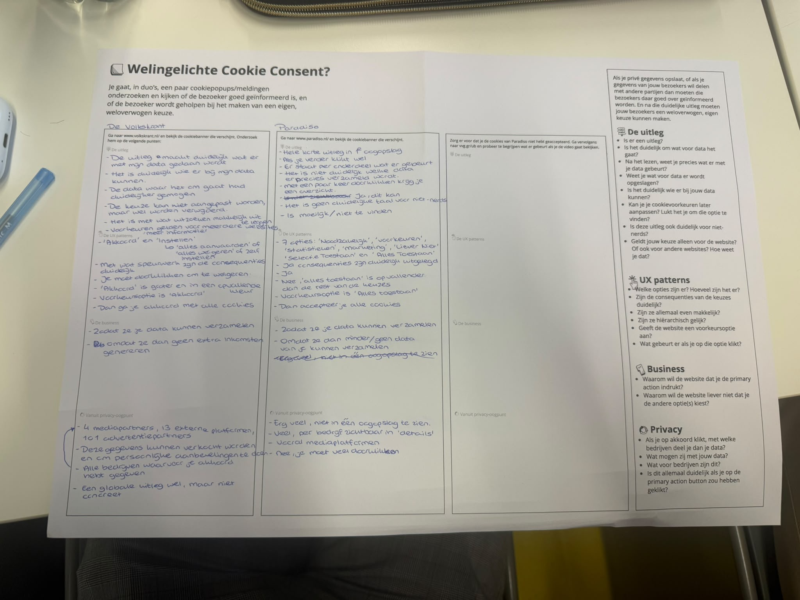
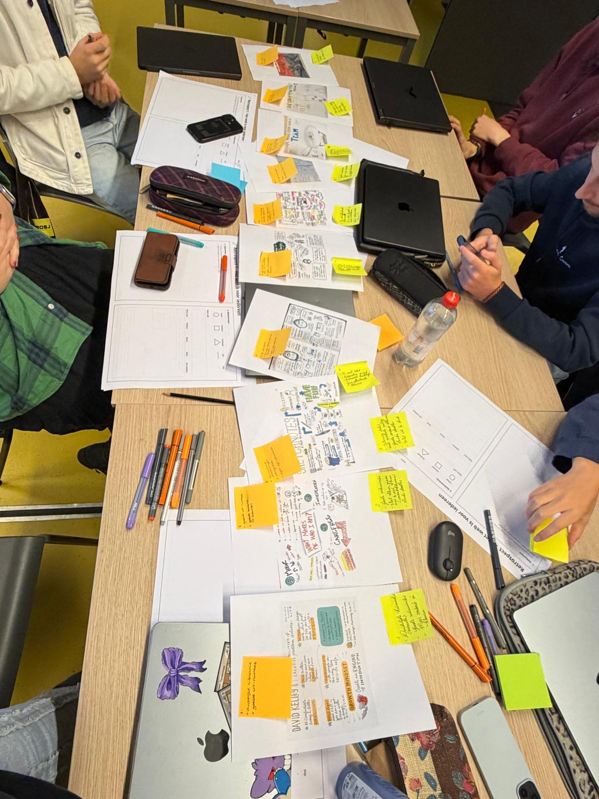

# Model

Het staat model voor digitale tuintjes welke bij 'Het web is voor iedereen' door studenten worden gemaakt.

## Learning Log

### 23 sept [Werkgroep 8]

Check-out

1. Een wireframe is een schematische schets van een pagina waarin ik laat zien hoe die eruit kan komen te zien: welke onderdelen erop staan, waar ze geplaatst worden en wat de interactieve elementen zijn.

Het nut ervan is dat ik snel verschillende layouts kan uitproberen en ideeën kan visualiseren, zonder me al druk te maken over kleur of detail. Dat maakt het makkelijk om ideeën te bespreken en aan te passen voordat ik tijd steek in een uitgewerkt design. Ik kan een wireframe LoFi (snel en simpel) of HiFi (gedetailleerder, bijvoorbeeld in Figma) maken.

2. Volgens NN/G zijn dit ontwerppatronen die gebruikers een actie laten uitvoeren die vooral goed is voor het bedrijf, door ze te misleiden, te sturen, te beschamen of tegen te werken als ze een andere (minder winstgevende) keuze willen maken.Een deceptive pattern is een designpatroon dat gebruikers aanzet tot een actie die het bedrijf ten goede komt, door de gebruiker te misleiden, misleidend te sturen, te beschamen, of tegen te werken bij het maken van een andere keuze. Ze werken vooral goed bij mensen die weinig tijd hebben of minder digitaal vaardig zijn.

Drie voorbeelden zijn:

1.  Obstruction (tegenwerking):
    Het bedrijf maakt het bewust lastig om iets te doen wat niet in hun voordeel is, bijvoorbeeld door opzeggen heel omslachtig te maken.
2.  Confirmshaming (emotionele manipulatie):
    Als je iets weigert (zoals een kortingscode), krijg je een schuldgevoel-tekstje te zien in plaats van een neutrale "nee, bedankt"-knop, zoals "nee, ik hou niet van besparen".
3.  Sneaking / preselection (stiekem toevoegen):
    Bij het afrekenen worden er automatisch extra items aan je winkelwagen toegevoegd, of extra opties alvast aangevinkt, zonder dat je dat zelf hebt gekozen. Jij moet het dan zelf ontdekken en uitzetten.

4.  Bij een human consent component moet ik als ontwerper vooral zorgen dat de gebruiker een eerlijke, vrije keuze heeft. Dat betekent dat weigeren net zo makkelijk moet zijn als accepteren, dat er niks alvast voor de gebruiker wordt aangevinkt, en dat ik geen schuldgevoel of tijdsdruk gebruik om iemand richting "ja" te duwen. Ook moet de tekst kort en duidelijk zijn, zodat iemand echt snapt waar diegene mee instemt, en moet die keuze later ook weer aan te passen zijn.

### 21 sept [Werkgroep 7]

Check-out

1. HTML Landmark Role Elements zijn elementen die de hoofdstructuur van een pagina aangeven. Denk aan: <header>,<nav> en <main>. Ze maken duidelijk welk deel van de pagina waarvoor dient.

2. Heading elementen zijn <h1> t/m <h6>, gebruikt om koppen en subkoppen aan te geven. Ze horen "genest" te worden: eerst één <h1> als hoofdtitel, daarna <h2> voor secties, daaronder <h3> voor subsecties, enzovoort, zonder niveaus over te slaan. Zo kun je met screenreaders snel door de structuur van de pagina navigeren, net als een inhoudsopgave.

3. Vroeger (op de middelbare school) drukte ik eigenlijk meteen op accepteer alles, omdat ik geen idee had wat cookies deden. Tegenwoordig heb ik veel meer over geleerd en zoek ik eigenlijk meteen naar de weiger alles knop. Zelfs als ik er wat meer moeite voor moet doen door alle voorkeuren weg te klikken.

### 18 sept [Werkgroep 6]

### 16 sept [Werkgroep 5]

### 14 sept - [Werkgroep 4]

Check-out

1. Een website wordt lelijk als hij niet responsive is, bijvoorbeeld dat alles verspringt op een mobieltje. Wat je eraan kunt doen is zorgen dat je de code ook test in mobiel formaat en aanpassingen maakt, zodat er niks verspringt. Daarnaast is een rommelige indeling niet mooi. Dit zorgt er namelijk voor dat de website niet toegangkelijk is voor bezoekers. Wat je eraan kan doen is met een duidelijke visuele hiërarchie werken. Als laatste zijn te veel animaties niet mooi. Animaties zijn leuk en interessant voor de website, maar wel met mate. Te veel animaties leidt af van de inhoud van de website. Gebruik animaties alleen wanneer ze iets toevoegen.

2. De volgende stap die ik ga zetten om mijn website responsive te maken is zorgen dat hij zich goed aanpast aan verschillende scherm formaten.

3.

Wat ik uit de voorbereiding haal is dat de samenleving ontzettend afhankelijk is van grote cloudbedrijven als Amazon. Als een van deze bedrijven uitvalt heeft dat grote gevolgen. Daarnaast zijn europese landen te afhankelijk van Chineese en Amerikaanse technologie bedrijven. Het is belangrijk dat Europa meer onafhankelijk wordt van buitelandse bedrijven.

### 12 sept - [Werkgroep 3]

De feedback die ik vandaag van Justus heb gekregen is dat het idee van portret tekenen heel leuk en persoonlijk is. Ik moet nu gaan bedenken hoe ik het ga uitwerken in html. Hij gaf mij bijvoorbeeld het idee om de achtergrond van de webpagina een soort werkplek te maken, dat je de potloden kan zien liggen en dan de tekeningen erin plaatsen. Maar ik moet er verder nog goed over nadenken en gewoon gaan proberen.

### 10 sept - [Werkgroep 2]

Check-out

1. vraag 1: Je begint met onderzoek, beelden verzamelen en inspiratie opdoen. Daarna ga je kijken welke beelden het meest relevant zijn. Daarna maak je van je onderzoek een duidelijk idee voor het ontwerp.

2. Mijn digital garden gaat over portret tekenen. Ik doe het over dit oinderwerp omdat het iets is wat ik zelf heel leuk vind om te doen en daarom kan ik mijn digital garden heel persoonlijk maken. Ik wil mijn digital garden vormgeven als een soort kunst galerij. Met daarin foto's van mijn eigen portretten en misschien ook van andere mensen. Als je op de foto klikt komt er een klein tekstje over de tekening.

3. Ik zou van de crazy 8 de eerste (links boven) uit willen werken. Ik denk namelijk dat dit een design is dat bruikbaar is voor laptop, maar ook nog goed eruit ziet op telefoon formaat. Daarnaast geeft het een beetje de sfeer van een galerij.
   

### 8 sept - deepdive Light & Dark theme (Vasilis)

### 7 sept - [Werkgroep 1]

Check-out

1. Een digital garden is een online plek waar iemand ideeën deeld over een onderwerp dat diegene aanspreekt. Een digital garden is nooit af. Er kunnen altijd nieuwe ideeën bijkomen. Pagina's worden aan elkaar gekoppeld op basis van inhoud en onderlinge verbanden. De schrijver heeft geen authoriteit en kan fout zitten en zijn mening veranderen.

2. Wat naar mijn idee een website webby maakt is dat er een structuur inzit die herkenbaar is voor de doelgroep, maar dat er ook verassende dingen in de website zitten die het interessant maken. Daarnaast is de typografie, hyrarchie en het contrast super belangrijk. Als bijvoorbeeld de contrasten tussen de kleuren heel slecht is zullen mensen je website minder snel lezen.

3. Ik ben er nog niet helemaal over uit welk onderwerp ik voor mijn digital garden ga gebruiken. Ik denk wel dat ik het over een hobby wil doen, wat dat geeft mij plezier en daar kan ik veel over kwijt. Waar ik nu tussen zit te twijfel is realistisch teken, skieën of hockeyen.

### 3 sept - [Workshop]

Het handigste wat ik bij de deepdive HTML & CSS Basics (Justus) geleerd heb is
dat alles werkt doordat een website geopend wordt dan een http request verzonden wordt
dat request wordt naar de server gestuurd en dan wordt de website geladen. Ik was verast dat de request meerdere keren verzonden moet worden voordat de website met de stijl die er gekozen is geladen is.

### 31 aug - Kickoff

Check-out
Een fork van de model repository gemaakt en gepubliceerd via mijn eigen Github omgeving.

1. Ik heb voor github gekozen als source hosting platform.

2. Ik heb voor tuintjevaneva als domein naam gekozen. Ik heb die gekoppeld door de stappen in dlo te
   volgen.

3. Je kan aanpassingen maken aan mijn pagina door de code aan te passen in vscode.
