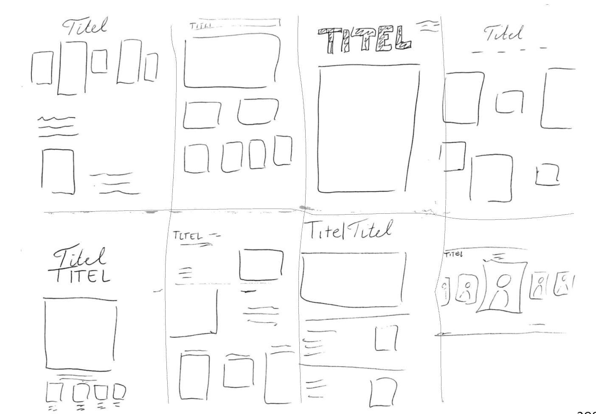
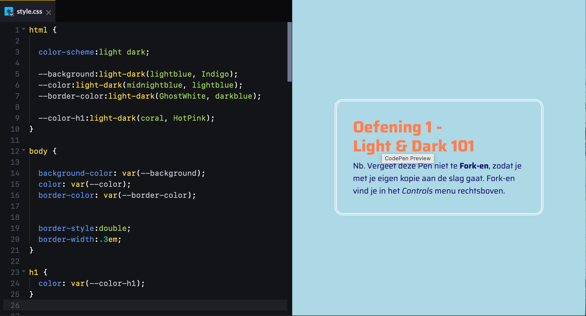

# Model

Het staat model voor digitale tuintjes welke bij 'Het web is voor iedereen' door studenten worden gemaakt.

## Learning Log

### 12 sept - [Werkgroep 3]

### 10 sept - [Werkgroep 2]

1. vraag 1: Je begint met onderzoek, beelden verzamelen en inspiratie opdoen. Daarna ga je kijken welke beelden het meest relevant zijn. Daarna maak je van je onderzoek een duidelijk idee voor het ontwerp.

2. Mijn digital garden gaat over portret tekenen. Ik doe het over dit oinderwerp omdat het iets is wat ik zelf heel leuk vind om te doen en daarom kan ik mijn digital garden heel persoonlijk maken. Ik wil mijn digital garden vormgeven als een soort kunst galerij. Met daarin foto's van mijn eigen portretten en misschien ook van andere mensen. Als je op de foto klikt komt er een klein tekstje over de tekening.

3. Ik zou van de crazy 8 de eerste (links boven) uit willen werken. Ik denk namelijk dat dit een design is dat bruikbaar is voor laptop, maar ook nog goed eruit ziet op telefoon formaat. Daarnaast geeft het een beetje de sfeer van een galerij.
   

### 8 sept - deepdive Light & Dark theme (Vasilis)

### 7 sept - [Werkgroep 1]

1. Een digital garden is een online plek waar iemand ideeën deeld over een onderwerp dat diegene aanspreekt. Een digital garden is nooit af. Er kunnen altijd nieuwe ideeën bijkomen. Pagina's worden aan elkaar gekoppeld op basis van inhoud en onderlinge verbanden. De schrijver heeft geen authoriteit en kan fout zitten en zijn mening veranderen.

2. Wat naar mijn idee een website webby maakt is dat er een structuur inzit die herkenbaar is voor de doelgroep, maar dat er ook verassende dingen in de website zitten die het interessant maken. Daarnaast is de typografie, hyrarchie en het contrast super belangrijk. Als bijvoorbeeld de contrasten tussen de kleuren heel slecht is zullen mensen je website minder snel lezen.

3. Ik ben er nog niet helemaal over uit welk onderwerp ik voor mijn digital garden ga gebruiken. Ik denk wel dat ik het over een hobby wil doen, wat dat geeft mij plezier en daar kan ik veel over kwijt. Waar ik nu tussen zit te twijfel is realistisch teken, skieën of hockeyen.

### 3 sept - [Workshop]

Het handigste wat ik bij de deepdive HTML & CSS Basics (Justus) geleerd heb is
dat alles werkt doordat een website geopend wordt dan een http request verzonden wordt
dat request wordt naar de server gestuurd en dan wordt de website geladen. Ik was verast dat de request meerdere keren verzonden moet worden voordat de website met de stijl die er gekozen is geladen is.

### 31 aug - Kickoff

Een fork van de model repository gemaakt en gepubliceerd via mijn eigen Github omgeving.

1. Ik heb voor github gekozen als source hosting platform.

2. Ik heb voor tuintjevaneva als domein naam gekozen. Ik heb die gekoppeld door de stappen in dlo te
   volgen.

3. Je kan aanpassingen maken aan mijn pagina door de code aan te passen in vscode.
